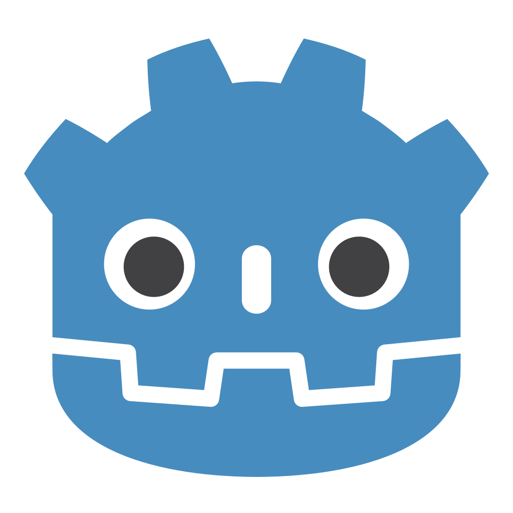
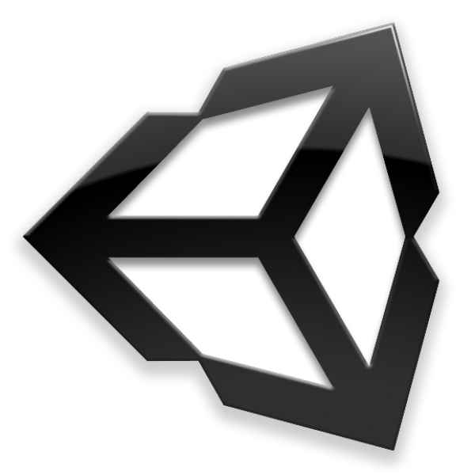
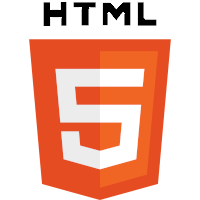
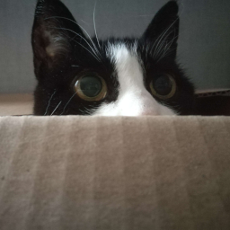
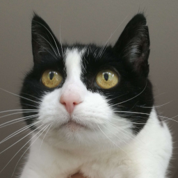
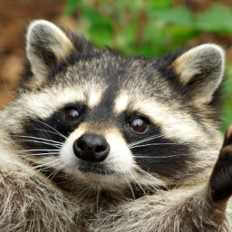
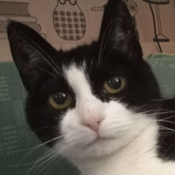

## About me
My interests include: game development, VR, Linux, FOSS, Rust, RISC, 3D modeling and conlangs.

All of my published games are on [crispypin.itch.io](https://crispypin.itch.io) and a few of them also have public repositories here.

### Notable projects
- [leko pona](https://github.com/CrispyPin/leko-pona) - my custom split ortholinear 36-key keyboard
- [sinpin-vr](https://github.com/CrispyPin/sinpin-vr) - a VR desktop overlay for Linux with multi-monitor support
- [OVR Utils](https://github.com/CrispyPin/ovr-utils) - a cross-platform SteamVR overlay app
- [lili](https://github.com/CrispyPin/lili) - a terminal text editor for Linux
- [gol-wallpaper](https://gol.crispypin.cc/?cellsize=5&time=2&margin=0&populate=true)([source](https://github.com/CrispyPin/gol-wallpaper)) - Conway's Game of Life in the browser (using GPU.js)
- [crispypin.cc](https://crispypin.cc) - where I've posted some other projects, but it's not up to date because web dev is boring

### Computer magic I know

### Languages
|"flag"|language|words|
|------|--------|-----|
|   | English   | From the moment I understood the weakness of my flesh, it disgusted me
|   | Svenska   | Jag vet hur man uttalar BLÅHAJ
| | toki pona | kijetesantakalu li lukin e sina
|       | Cat       | mrrp :3
