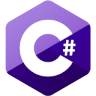
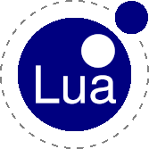

## Hello

I am a game dev and Linux nerd, all my games are on [itch.io](https://crispypin.itch.io).

Current projects include: 
- Learning Rust & godot-rust
- Learning the [ASETNIOP](https://asetniop.com/) keyboard layout, for some reason
- My website [crispypin.cc](https://crispypin.cc)
- My SteamVR overlay app, [OVR Utils](https://github.com/CrispyPin/ovr-utils)

Currently using Arch Linux with AwesomeWM on my PC & laptop and Ubuntu on my server.

I also love FOSS if that wasn't obvious.

### Computer magic I know well:

### Computer magic I am learning:

### Computer magic I have used for smaller projects:

